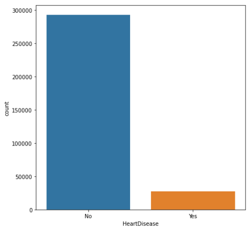
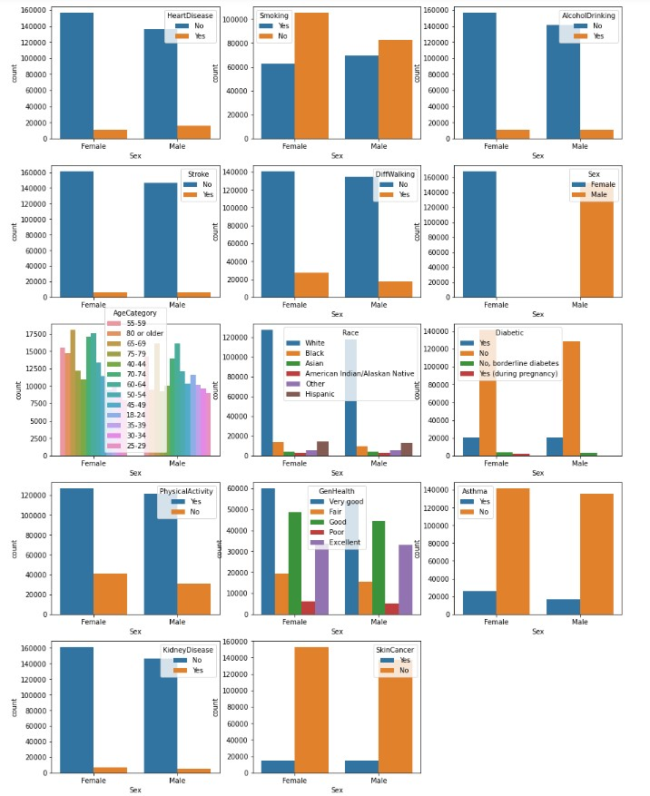
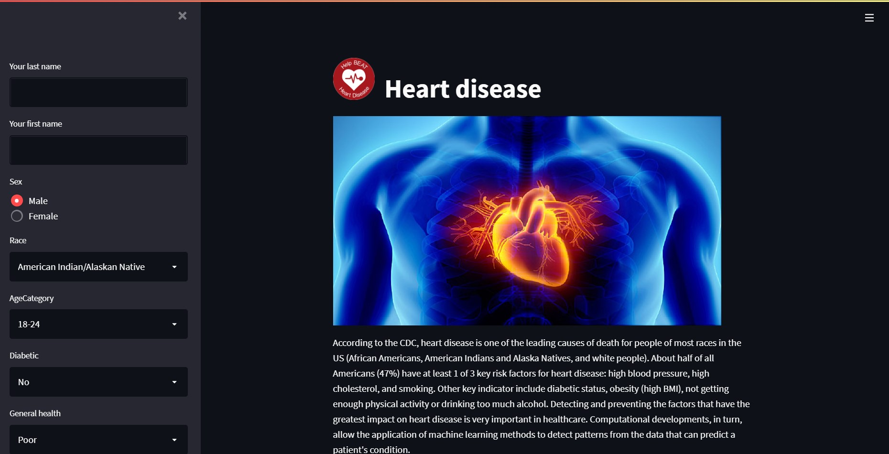

This folder is the work on our machine learning project, it includes several ML models, essentialy: LogisticRegression, MLPClassifier, SGDClassifier, StackingClissifier...
Using [Personal Key Indicators of Heart Disease Dataset](https://www.kaggle.com/datasets/johnsmith88/heart-disease-dataset), our final model should be able to disguish between a sick patient and a healthy one.

<div align="center">
  
</div>
<br>

# Dataset :

## Context of the dataset :

According to the CDC, heart disease is one of the leading causes of death for people of most races in the US (African Americans, American Indians and Alaska Natives, and white people). About half of all Americans (47%) have at least 1 of 3 key risk factors for heart disease: high blood pressure, high cholesterol, and smoking. Other key indicator include diabetic status, obesity (high BMI), not getting enough physical activity or drinking too much alcohol. Detecting and preventing the factors that have the greatest impact on heart disease is very important in healthcare. Computational developments, in turn, allow the application of machine learning methods to detect "patterns" from the data that can predict a patient's condition.

## Dataset visualization :

The original dataset was of nearly 300 variables but the one used in this project only contains 20 ones. The variable "HeartDisease" is the target which is a binary ("Yes" : The patient has a heart disease; "No" : The patient do not have a heart disease),
however the classes are not balanced

<div align="center">
  
</div>
<br>

## The features :

- HeartDisease ➔ Binary (Yes or No)
- BMI (Body mass Indix) ➔ (values)
- Smoking ➔ Have you smoked at least 100 cigarettes in your entire life? (The answer is binary (Yes or No))
- AlcoholDrinking ➔ Heavy drinkers : adult men having more than 14 drinks per week and adult women having more than 7 drinks per week (The answer is binary (Yes or No))
- Stroke ➔ (Ever told) (you had) a stroke? (The answer is binary (Yes or No))
- PhysicalHealth ➔ Now thinking about your physical health, which includes physical illness and injury, for how many days during the past 30 days was your physical health not good? (0-30 days).
- MentalHealth ➔ Thinking about your mental health, for how many days during the past 30 days was your mental health not good? (0-30 days).
- DiffWalking ➔ Do you have serious difficulty walking or climbing stairs? (The answer is binary (Yes or No))
- Sex ➔ Are you male or female? (The response is binary (Female or Male))
- AgeCategory ➔ Fourteen-level age category.
- Race : Imputed race/ethnicity value.
- Diabetic : (Ever told) (you had) diabetes?
- PhysicalActivity : Adults who reported doing physical activity or exercise during the past 30 days other than their regular job.
- GenHealth : Would you say that in general your health is...
- SleepTime : On average, how many hours of sleep do you get in a 24-hour period?
- Asthma : (Ever told) (you had) asthma?
- KidneyDisease : Not including kidney stones, bladder infection or incontinence, were you ever told you had kidney disease?
- SkinCancer : (Ever told) (you had) skin cancer?

<div align="center">
  
</div>
<br>

## Dataset pre-processing :

We have around 319795 entries with 18 columns. No null values, and we have 14 numeric features, and 4 categorial features. We can convert the string attributes that has only limited possibilities to integer values, such as :

- Race
- Diabetic
- Sex
- AgeCategory
- GenHealth

The dataset is then splitted into Train/test.

# Modelling :

The different models are trained on the initial set of features, therefore we will be evaluating the estimator based on the testing accuracy rather than the training accuracy.
For each model we used sklearn GridSearchCv to get the optimum parameters for better results.
The accuracy for the estimators is as follow :
|Classifier | Accuracy|
|----------|:-------------:|
|Logistic Regression| 0.91 |
|Linear SVC|0.91|
|KNeighbors Classifier |0.90|
|SGD Classifier|0.91|
|Random Forest Classifier|0.91|
|Gradient Boosting Classifier|0.91|
|Decision Tree Classifier|0.92|
|AdaBoost Classifier|0.92|
|GradientBoosting|0.92|  
|MLP Classifier|0.92|
|AdaBoost|0.92|

Now that we trained and test on different classifiers with tuning technique (GridSearchCV), we can then proceed with the choosing the most adequate estimator for the given project.

## Voting Classifier :

A voting classifier is a machine learning estimator that trains various base models or estimators and predicts on the basis of aggregating the findings of each base estimator. The aggregating criteria can be combined decision of voting for each estimator output.
The base estimators used are : SGD Classifier, Decision Tree and KNeighbors Classifier.
To configure the parameters, GridSearchCV is a must here as well.
| | precision | recall | f1-score | support|
|----------|:-------------:|------:|------:|------:|
| 0 | 0.93 | 0.91 | 0.92 | 58513|
| 1 | 0.22 | 0.26 | 0.24 | 5446|
| accuracy | | 0.86 | 63959|
| macro avg | 0.57 | 0.59 | 0.58 | 63959|
|weighted avg | 0.87 |0.86 | 0.86 | 63959|

## Stacking Classifier :

Taking the following estimators : KNeighbors Classifier, Logistic Regression and Random Forest.
stacking classifier is to make predictions with those several models, and then use those predictions as features for a higher-level meta model.
| | precision | recall | f1-score | support|
|----------|:-------------:|------:|------:|------:|
| 0 | 0.92 | 1.00 | 0.96 | 58521|
| 1 | 0.32 | 0.01 | 0.02 | 5438|
| accuracy | | 0.91 | 63959|
| macro avg | 0.62 | 0.50 | 0.49 | 63959|
|weighted avg | 0.86 |0.91 | 0.88 | 63959|

## Models file : [Models](https://mega.nz/folder/us9BVTYS#a-HUr6j-KINIYOyhd2iQ-w)
# Inference :

Using [Streamlit](https://github.com/streamlit/streamlit), we built a web application to predict the person's heart health condition based on a well-trained machine learning algorithm.
To pick the adequate model with whom we will apply the algorithm, it's more convenient to pick it based on the recall value which represent the probability of diagnosing a sick person as being healthy.

<div align="center">
  
</div>
<br>

# ✨ How to use it

- To run the app you have to :
  Add file **"RandomForestClassifier.pkl"** to folder **"ModelSelection"**

  ➔ run :  
  ```bash
  pip install -r requirements.txt 
  ```
  ➔ run : 
  ```bash
  streamlit run App.py
  ```
